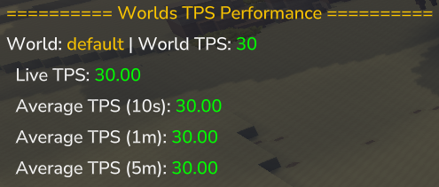

# Hytale TPS Monitor Mod

This mod provides detailed **TPS (Ticks Per Second) and MSPT (Milliseconds Per Tick) monitoring** for each world on a
Hytale server.

## Features

- Displays the **configured target TPS** for each world.
- Shows **real-time TPS** calculated from actual tick progression.
- Shows **real-time MSPT** based on tick execution time.
- Provides **average TPS** over the last **10 seconds, 1 minute, and 5 minutes**.
- If the server has not been running long enough, averages are calculated using the available runtime.
- Supports a **live on-screen display** for continuous TPS & MSPT monitoring.
    - Works standalone or alongside MultiHUD

## Usage

Simply run the `/tps` command in the console or in-game.  
The command outputs TPS information for all loaded worlds, helping you detect lag or performance issues in real time.

Use `/tps show` to toggle the hud display on and off.
The hud will show the TPS and MSPT for the current world you are in.

## Reporting Bugs

If you encounter any bugs or issues while using this mod, please let me know.  
The GitHub repository will be available shortly.
